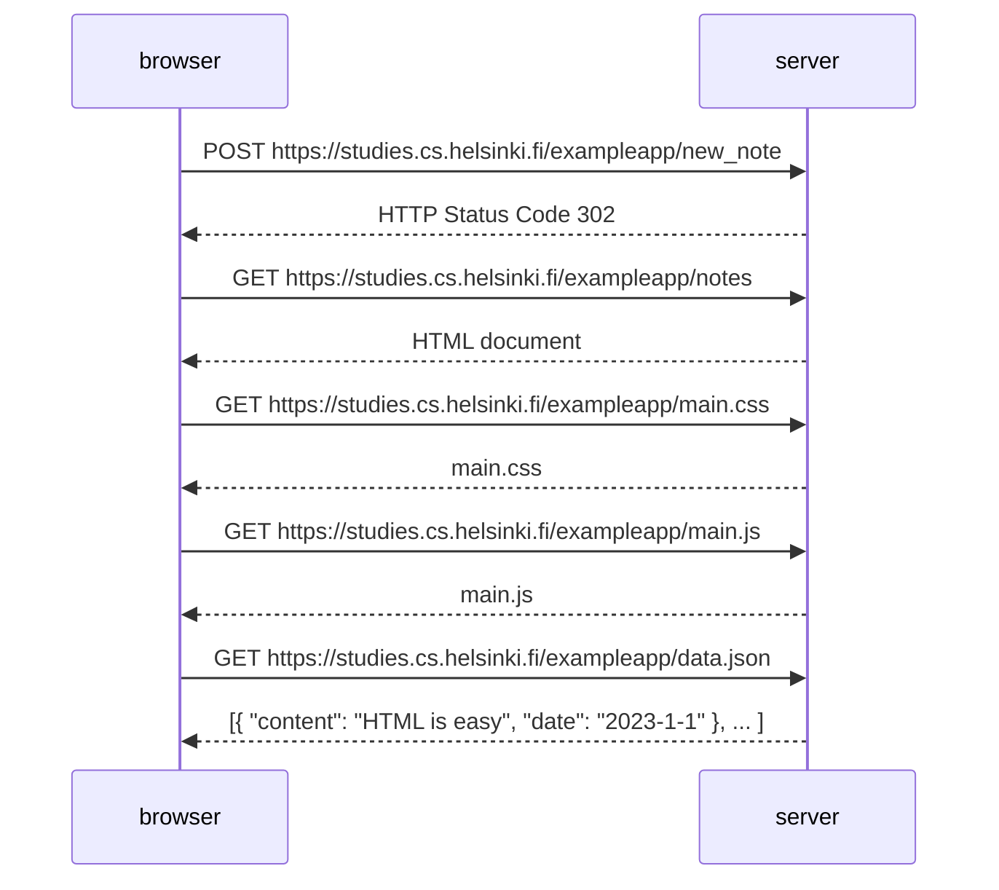

```mermaid
sequenceDiagram
    participant browser
    participant server

    browser->>server: POST https://studies.cs.helsinki.fi/exampleapp/new_note
    server-->>browser: HTTP Status Code 302

    browser->>server: GET https://studies.cs.helsinki.fi/exampleapp/notes
    server-->>browser: HTML document

    browser->>server: GET https://studies.cs.helsinki.fi/exampleapp/main.css
    server-->>browser: main.css

    browser->>server: GET https://studies.cs.helsinki.fi/exampleapp/main.js
    server-->>browser:  main.js

    browser->>server: GET https://studies.cs.helsinki.fi/exampleapp/data.json
    server-->>browser: [{ "content": "HTML is easy", "date": "2023-1-1" }, ... ]
```